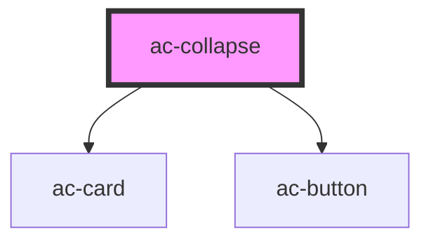

# ac-collapse

<!-- Auto Generated Below -->

## Properties

| Property   | Attribute  | Description | Type      | Default     |
| ---------- | ---------- | ----------- | --------- | ----------- |
| `expanded` | `expanded` |             | `boolean` | `undefined` |

## Events

| Event    | Description | Type                                  |
| -------- | ----------- | ------------------------------------- |
| `toggle` |             | `CustomEvent<{ expanded: boolean; }>` |

## Dependencies

### Depends on

- [ac-card](../../atoms/ac-card)
- [ac-button](../../atoms/ac-button)

### Graph

----------------------------------------------

*Built with [StencilJS](https://stenciljs.com/)*
